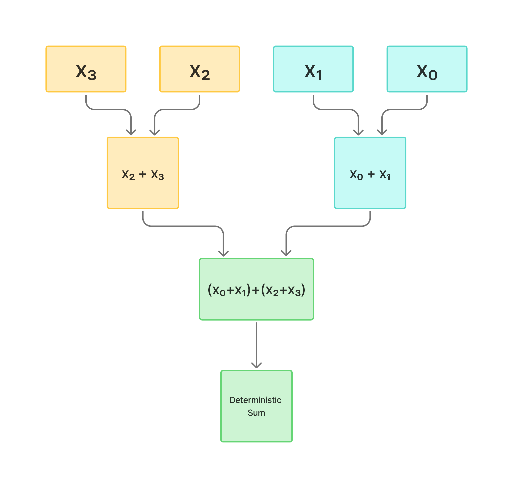

# BitExact Design Document

- [Why Determinism](#0-why-determinism)
- [Overview](#1-overview)
- [Design Principles](#2-design-principles)
- [System Architecture](#3-system-architecture)
- [Deterministic Reduction](#4-deterministic-reduction-operations)
- [Layer Normalization](#5-layer-normalization)
- [Deterministic MatMul](#6-deterministic-matmul)
- [Root Mean Square Layer Normalization](#7-root-mean-square-layer-normalzation)
- [Memory and Precision](#8-memory-and-precision)
- [Testing and Validation](#9-testing-and-validation)
- [Future Work](#10-future-work)

## 0. Why Determinism?

Reproducibility is essential for research and scientific progress. In modern machine learning, achieving reproducibility is increasingly difficult due to inherent non-determinism in modern GPUs. Floating point arithmetic on GPUs is non-associative by nature, meaning that small changes in arithmetic order can lead to noticeable output inconsistencies. These discrepancies compound in deep learning models, making it hard to verify whether differences in results arise from architecture changes, initialization, or simple numerical noise.

Determinism addresses this by enforcing fixed order arithmetic and reduction regardless of hardware, batchsize, devices, and drivers. By eliminating numerical variance, researchers can isolate effects of architectural or algorithmic changes, therefore enabling cleaner experiments, definitive ablation studies, and verifiable baselines.

BitExact was developed for this exact purpose; to provide a library that enforces fixed order reduction and reproducible inference. If two runs use the same inputs, they will produce the bit identical outputs on BitExact's kernels. This principle turns determinism into a dependable scientific tool, rather than a convenient debugging model.

## 1. Overview

BitExact is a research driven CUDA library, focused on bit level reproducibility in deep learning. It provides deterministic implementations of core tensor operations such as normalization, matrix multiplication, and reduction, ensuring that runs yield bit identical results across devices, architectures, drivers, and batches.

The library is designed as a plug-and-play supplement to PyTorch, enabling developers and researchers to make their models deterministic without modifying model architecture or code. Each kernel is implemented with fixed order arithmetic traversal order, warp-synchronous reductions, and strict rounding error control, thereby removing common sources of non-determinism commonly introduced by parallel reduction patterns and thread scheduling.

BitExact is not meant to be outperform highly optimized vendor kernels (like CuBLAS). It was primarily developed to establish a deterministic computational baseline for model evaluation, reproducibility research, and numerical verification. While the development of BitExact was not inherently performance based, many optimizations have been made to the kernels to reduce memory operations use warp-synchronous reductions, and fuse common arithmetic stages, thereby offering competitive or superior performance on small to medium tensors in initial testing. These results were not the goal of the project but highlight that determinism and efficiency are not mutually exclusive when kernel design is carefully controlled.

In addition to this, BitExact is implemented in a modular architecture, allowing each kernel to be benchmarked, tested, and improved independently therefore making the library extensible for further kernel development.

## 2. Design Principles

BitExact's architecture is guided by a few principles ensuring bit exact determinism without sacrificing maintainability or clarity.

### Fixed Order Arithmetic

All reductions and accumulations are implemented using fixed order traversals, therefore ensuring determinism across runs, threads, and blocks. This eliminates nondeterminism introduced by thread scheduling, warp-level divergence, or floating-point non-associativity. This is detailed further in the individual kernel sections.

### Warp-Synchronous Reductions

To minimize thread synchronization and memory usage, warp-synchronous reductions are heavily utilized in BitExact's kernels. A warp is simply a collection of 32 threads that execute instructions in lockstep within a single GPU core. By restricting reductions to operate within a warp, BitExact avoids global or block wide synchronization instructions that slow down kernel execution. In essence, synchronizing 32 threads in a warp is far more effecient than coordinating hundreds of threads across an entire block.

### No Atomics or Race Conditions

BitExact explicitly avoids atomic additions, unordered shared memory operations and any operation that depends on execution timing. Timing variability is a fundamental source of inconsistency in parallel computing programs - making strict reductions and memory operations essential for determinism.

### Consistent Precision and Rounding

All kernels operate in FP32 by default, using CUDA compiler flags (`--fmad=false`, `--prec-div=true`, `--prec-sqrt=true`) to disable hardware-level instruction fusion that could alter arithmetic order or precision.
This ensures that identical inputs always produce identical binary outputs.

### Deterministic Memory Access

All global and shared-memory reads/writes are performed using contiguous, coalesced access patterns with explicitly defined traversal order. This minimizes hidden nondeterminism from caching, bank conflicts, or compiler-driven memory optimizations.

## 3. System Architecture

BitExact follows a layered architecture designed for modularity, clarity, and testability. Each layer is deterministic in behaviour, while remaining decoupled from higher-level abstractions. At a high level, the system architecture can be broken down into four main components.

### Python Interface

The public interface exposed to users, and integrated with PyTorch. Each operation is defined in `__init__.py`and calls the corresponding CUDA function from `_C`. This layer handles user facing documentation, and argument validation.

### C++ Bindings

This layer is what connects the CUDA kernels to the Python interface. It registers all CUDA Kernels as callable PyTorch extensions through the `PYBIND11_MODULE`. Each function recieves a `torch.Tensor` object, validates the representation invariants, and dispatches execution to the appropriate CUDA Kernel.

### CUDA Kernels

The CUDA kernels are the source of BitExact. Each operation is implemented as a seperate CUDA file (`.cu` and `.cuh`) in a folder by the kernels category. These kernels implement fixed-order arithmetic traversal, warp-synchronous reductions, and strict precision control to guarantee deterministic results.

### Testing and Benchmarking

The testing and benchmarking sections of the architecture are necessary for validating kernel correctness and effeciency. They can be found in the `bitexact/benchmarks` folder, and `bitexact/tests` folder respectively. These layers ensure that determinism is verified quantitatively, and not just by inspection.

### New Kernels

To register a new kernel:

- Implement the kernel in its respective category within `src/ops` (Must include `.cu` and `.cuh` files - keep kernels fused)
- Register the kernel within `setup.py`, `__init__.py`, and `bindings.cpp`
- Implement testing and benchmarking functions in `tests/test_determinism.py`, and `benchmarks/benchmark.py` respectively.

You are not feel limited to the current sub folders that exist within `src/ops`, but please keep novel kernels within their respective modules when possible to maintain consistent project structure.

## 4. Deterministic Reduction Operations

Reduction operations are some of the most common sources of nondeterminism in GPU computation. Traditional GPU reductions rely on atomic operations, or thread-level accumulation patterns that vary in execution between runs. This occurs due to timing invariance on a run-to-run basis. In addition, floating point arithmetic in GPUs is inherently non-associative. This is to say $(a + b) + c \neq a + (b + c)$. This makes fixed order reduction and accumulation order essential for determinsitic GPU kernels.

BitExact addresses this performing warp-synchronous, and tree style reductions across its kernels, where the order of pairwise summations is explicitly defined and identical on a run-to-run basis. This pattern eliminates race conditions and ensures reproducible partial sums in arithmetic accumulation. (See Figure 1)

Each reduction kernel is further optimized to minimize global memory operations and shared-memory usage, enabling both deterministic and efficient computation. Together, these methods guarantee that BitExact’s reduction outputs remain identical across runs, devices, and driver versions

_Figure 1. Warp-synchronous tree-style reduction ensuring fixed accumulation order._

## 5. Layer Normalization

Layer Normalization (LayerNorm) provides feature-wise normalization by centering and scaling activations across each sample’s hidden dimension. In non-deterministic GPU implementations, this step can produce subtle numerical drift due to unordered summation and variance calculations across threads. BitExact eliminates that drift through fixed-order reductions and fused computation.

The kernel operates in four stages:

**Deterministic Mean and Variance**

The mean and variance for each batch element are computed using BitExact’s deterministic reduction kernels, which employ warp-synchronous, tree-style accumulation to ensure fixed arithmetic order.
This guarantees reproducibility across executions and hardware configurations.

**Normalization and Affine Transform**

In a single fused pass:

- Each thread block handles one batch element
- The mean and variance are broadcast from the reduction stage
- A precomputed inverse standard deviation deterministically scales inputs

**Vectorized Memory Access**

To maximize throughput, operations are vectorized using `float4` loads and stores, reducing global memory transactions by a factor of 4.

**Precision and Synchronization**

All operations are performed in FP32, with no atomic operations or asynchronous accumulation. The kernel executes per-batch independently, ensuring that no inter-block timing affects numerical outcomes.

**Result**
This design yields a bit-exact LayerNorm that matches PyTorch’s functional output while guaranteeing reproducibility.

## 6. Deterministic MatMul

Matrix multiplication is one of the most performance critical operations in deep learning, while also being susceptible to nondeterministic behaviour. BitExact's MatMul kernel is designed as follows:

**Fixed Tiling Pattern**

Each CUDA block computes a 32x32 tile of the output. The tiling strategy is static, both thread and memory mapping remain identical between runs batch sizes ensuring consistent accumulation order.

**Thread Work Assignment**

Each thread is assigned a 2x2 output sub-tile. Thread indices `(tx, ty)` are derived deterministically from `threadIdx.x` forming a 16x16 layout per block.

\*\*Shared Memory Tiles

Input tiles A and B are cooperatively loaded into memory with boundary checks for partial tiles. Out-of-range elements are zero-padded removing any undefined memory reads.

**Deterministic Accumulation**

Each thread maintains its 2x2 accumulator in registers, and the loop does not contain atomics or unrolled reductions.

**Memory Write Back**

Results are written back in a deterministic order with explicit bounds checks to handle incomplete tiles at the matrix edges.

**Result**: A small sacrifice in throughput compared to cuBLAS's GEMM, but a strictly reproducible kernel.

## 7. Root Mean Square Layer Normalzation

RMSNorm simplifies the LayerNorm operation by not mean-centering, and normalizing only by the root mean square of the activations. This makes the operation both faster and more numerically stable. The operation is implemented as a fused CUDA kernel that:

- Computes sum by warp-synchronous reduction
- Divides the feature count and applies the square root (Currently FP32)
- Multiplies the normalized output by the learned weight vector (vectorized in float4 for memory effeciency)

RMSNorm extends the deterministic reduction logic of LayerNorm using identical accumulation and traversal order. The absence of mean subtraction elimations additional synchronization therefore increasing kernel throughput (especially on smaller tensors). This makes it ideal for architectures like transformers and diffusion models.

## 8. Memory and Precision

At the moment, all BitExact kernels use FP32 precision. To prevent compiler level instruction reordering, the `-fmad=false` flag disable fused multiply-add (FMA) optimizations, ensuring consistent rounding across arithmetic operations.

Key precision techniques for BitExact are:

- No atomic operations: atomic operations can introduce non-associativity
- Determinisitc Shared memory Access: Avoids race conditions across warps
- Consistent alignment: all vectorized operations are 16-byte aligigned to maintain predictable memory coalescing

## 9. Testing and Validation

Every BitExact kernel undergoes deterministic equality testing to confirm bitwise reproducibility. The [test suite](../tests/test_determinism.py) verifies that the output of each kernel is bit identical across runs on a given device, and that it matches PyTorch's functional results within a strict tolerance.

[Benchmark tests](../benchmarks/benchmark.py) compare BitExact's kernels against PyTorch's implementations, reporting relative throughput. Please note that library was created individually with limited computational testing resources. As such, benchmark results should be interpreted as approximate performance indicators on small tensors, not rigorous scientific measurements.

While BitExact achieves competitive output on small tensors in preliminary testing, it is not designed to outperform highly optimized industry standard kernels (ie cuBLAS, cuDNN). Its primary purpose is to provide a deterministic computational baseline for research, evaluation, and reproducibility testing.

## 10. Future Work

BitExact currently implements deterministic forward kernels for normalization, reduction, activation, and matrix multiplication. These operations provide a strong foundation in reproducible inference, but there are several areas that could be expanded if the idea continues to evolve.

### Deterministic Backward Passes

Implementing gradient kernels for fixed order reduction would allow for reproducible training, not just inference. Implementing deterministic backward passes would eliminate another source of variance, further stabilizing experimental results.

### Deterministic Attention

Extending determinism to attention mechanisms remains an open challenge given the complexity and scale of the operation. While prerequisite components such as softmax could be implemented deterministically, an ideal solution is a fused attention kernel combining operations into one monolithic CUDA program. This is a difficult problem due to exponential scaling and reduction order sensitivity, but this development would make this library applicable to transformer architectures.

### Mixed Precision Operations

Currently, BitExact uses FP32 arithmetic for full bit stability. Further development could implement FP16/BF16 accumulation, consistent rounding across GPU generations, and expand the library to other parallel computing platforms such as AMD's ROCm.

### Verification and Benchmarking

A formal test harness could be implemented, constantly validating determinism and performance across different GPUs and driver versions, expanding on the current pytest-based equality programs.
